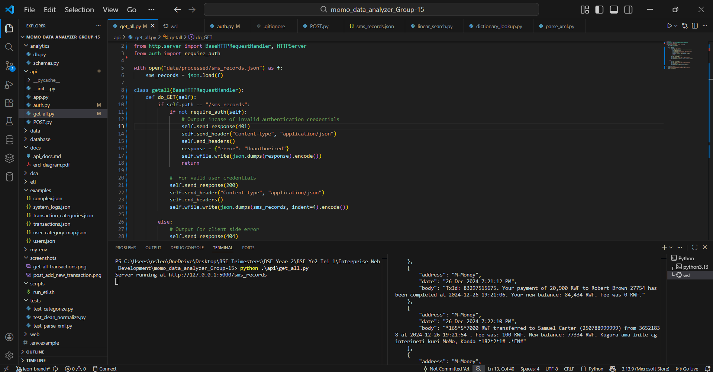
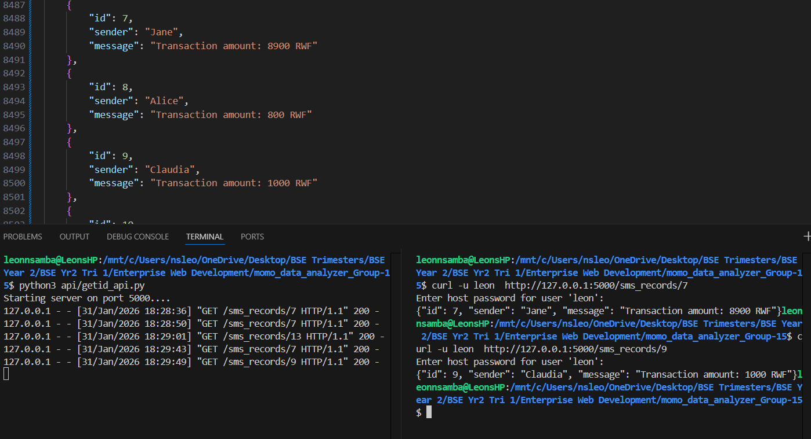
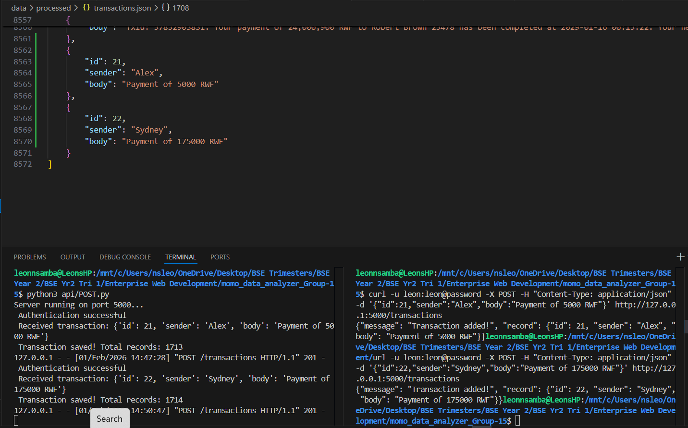
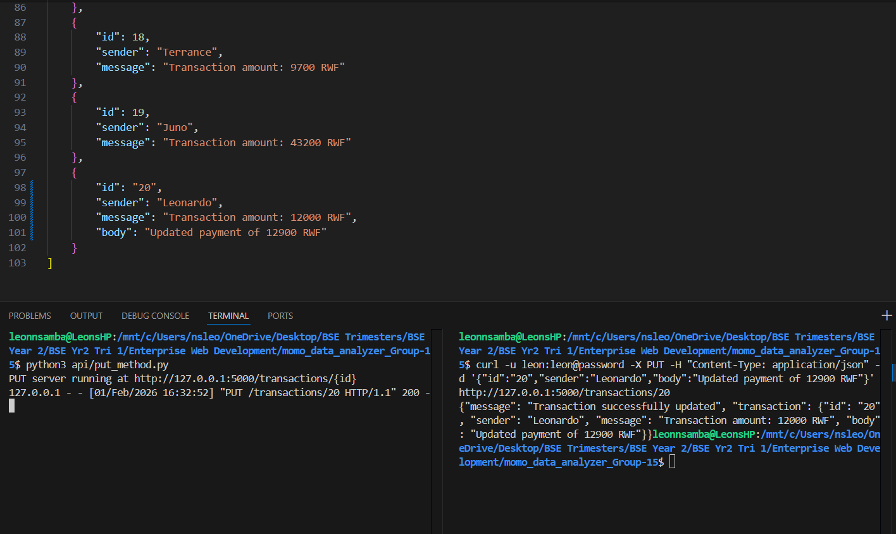
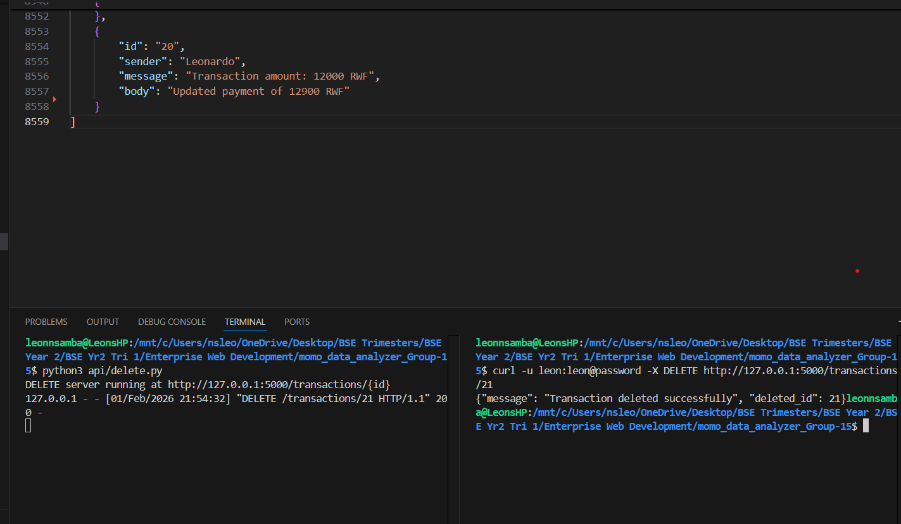

<h1 align="center"> 📝 API DOCUMENTATION </h1>

## 1. GET /transactions
<li>Description - Retrieves and lists all SMS transaction records from transactions.json </li>
<li>CURL Request - curl -X GET http://127.0.0.1:5000/transactions </li>
<li>Response Example</li>

<li>Status Codes</li>
i. 200 - OK  
i. 404 - No records exist or endpoint incorrect  
ii. 401 - Missing or invalid credentials  
iii. 404 - No records exist or endpoint incorrect  
iv. 500 - Server cannot read the JSON file
 
 

## 2. GET /transactions{id}
<li>Description - Retrieves singular transaction whose id is specified by user
 </li>
<li>CURL Request - curl  -u leon http://127.0.0.1:5000/transactions/4 </li>
<li>Response Example</li>

<li>Status Codes</li>
i. 200 - OK  
i. 404 - No records exist or endpoint incorrect  
ii. 401 - Missing or invalid credentials  
iii. 404 - No records exist or endpoint incorrect  
iv. 500 - Server cannot read the JSON file
 
 

## 3.  POST /transactions
<li>Description - Adds a new transaction to the existing json file
<li>CURL Request - 
curl -X POST http://127.0.0.1:5000/transactions \
 -H "Content-Type: application/json" \
-u mitchell:mitchell_password \
'{"id":21,"sender":"Alex","message":"Payment of 5000 RWF"}'
</li>
<li>Response Example</li>

<li>Status Codes</li>
i. 200 - OK  
ii. 201 - Successfully created a new record
iii.400 - Bad request 
iv. 401 - Missing or invalid credentials  
v. 500 - Server cannot read the JSON file
 
 

## 4.  PUT /transactions{id}/
<li>Description - Updating an existing transaction
<li>CURL Request - 
curl -u mufaro:mufaro@alu12 -X PUT -H "Content-Type: application/json" \
-d '{"id":”20”,"sender":"Leonardo","body":"Updated payment of 12900 RWF"}' \
http://127.0.0.1:5000/transactions/20
</li>
<li>Response Example</li>

<li>Status Codes</li>
i. 200 - OK  
ii. 400 - Invalid JSON sent   
iii. 401 - Unauthorized access / Invalid credentials   
iv. 404 - ID does not exist in the JSON file   
v. 409 - Update conflict with existing data (duplicate ID)   
vi. 500 - JSON corruption   
 

## 5.  DELETE/transactions/{id}
<li>Description - Deletes a record
<li>CURL Request - 
curl -u michael:mich123 -X DELETE http://127.0.0.1:5000/transactions/3 </li>
<li>Response Example</li>

<li>Status Codes</li>
i. 200 - OK  
ii. 400 - Bad Request (Invalid ID)  
iii. 401 - Unauthorized access  
iv. 404 - ID referenced to be deleted is not found  
v. 500 - JSON corruption  

 
